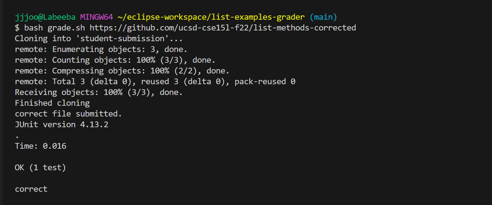
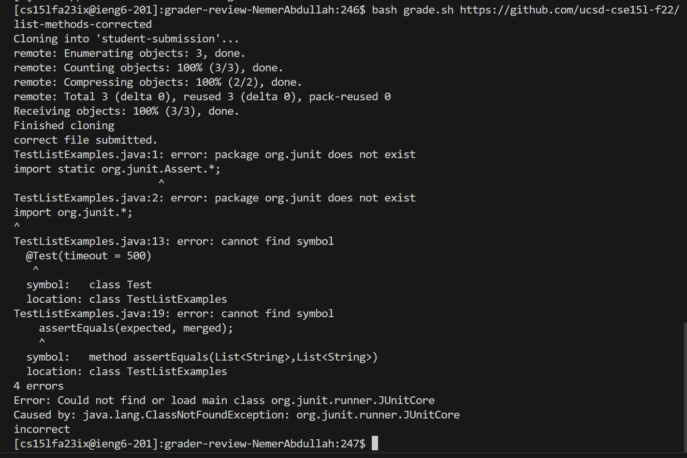
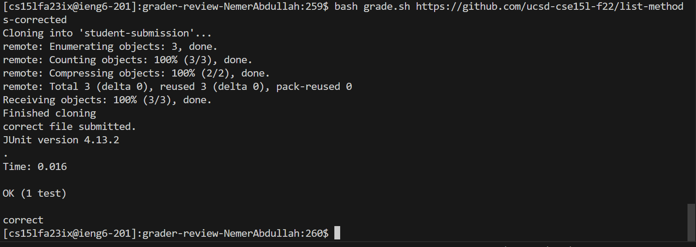

## 1-Student message

Hello, for the past lab, I made the grade.sh script and it works when I try it on my computer. This is the script on my computer:

However, when I pushed it to github for my lab partner to test it, it did not seem to work and instead I get the following error:


here is my code. I am guessing that it might be something to do with his pc being mac and mine being windows but im not sure whats wrong.
```
set -e

CPATH=".;lib/hamcrest-core-1.3.jar;lib/junit-4.13.2.jar"
rm -rf student-submission
rm -rf grading-area

mkdir grading-area

git clone $1 student-submission
echo 'Finished cloning'

#2

files=`find student-submission`s
if [[ -f student-submission/ListExamples.java ]]
then
echo  correct file submitted.
else
echo not found
fi

#3
cp -r TestListExamples.java lib student-submission/ListExamples.java grading-area
set +e
#4 
cd grading-area
javac -cp $CPATH *.java 
java  -cp $CPATH org.junit.runner.JUnitCore TestListExamples
if [[ $? == 0 ]]
then
    echo 'correct'
else
    echo 'incorrect'
fi
# Draw a picture/take notes on the directory structure that's set up after
# getting to this point

```

## 2-TA reply
You're right! look at line 3 in your script. Week 4 lab might be helful to check out to help you recognize your mistake.
It might be a good idea to upload your projects to the remote server so that you can be sure that your sumbissions work correctly.

## 3-Student reply
found the mistake! I used the double quotations marks (") which work on windows, but not on mac or linux systems. I also used a semi-colon
instead of a colon for the same reason. Here is my script running correctly on the server:



## 4-Info

file structure:
-TestExamples.java

- Server.java

- GradeServer.java

- lib

-- hamcrest-core-1.3.jar

-- junit-4.13.2.jar


- the graded assignment link: https://github.com/ucsd-cse15l-f22/list-methods-corrected


contents before the fix of the script:
```
set -e

CPATH=".;lib/hamcrest-core-1.3.jar;lib/junit-4.13.2.jar"
rm -rf student-submission
rm -rf grading-area

mkdir grading-area

git clone $1 student-submission
echo 'Finished cloning'

#2

files=`find student-submission`s
if [[ -f student-submission/ListExamples.java ]]
then
echo  correct file submitted.
else
echo not found
fi

#3
cp -r TestListExamples.java lib student-submission/ListExamples.java grading-area
set +e
#4 
cd grading-area
javac -cp $CPATH *.java 
java  -cp $CPATH org.junit.runner.JUnitCore TestListExamples
if [[ $? == 0 ]]
then
    echo 'correct'
else
    echo 'incorrect'
fi
```

contents of code after the fix:
```
set -e

CPATH='.:lib/hamcrest-core-1.3.jar:lib/junit-4.13.2.jar'
rm -rf student-submission
rm -rf grading-area

mkdir grading-area

git clone $1 student-submission
echo 'Finished cloning'

#2

files=`find student-submission`s
if [[ -f student-submission/ListExamples.java ]]
then
echo  correct file submitted.
else
echo not found
fi

#3
cp -r TestListExamples.java lib student-submission/ListExamples.java grading-area
set +e
#4 
cd grading-area
javac -cp $CPATH *.java 
java  -cp $CPATH org.junit.runner.JUnitCore TestListExamples
if [[ $? == 0 ]]
then
    echo 'correct'
else
    echo 'incorrect'
fi
```
Since this is a script and not a java file, I did not use jdb debugging to solve the issue. 


The edited part: ".;lib/hamcrest-core-1.3.jar;lib/junit-4.13.2.jar" to '.:lib/hamcrest-core-1.3.jar:lib/junit-4.13.2.jar'

## Part 2
I learned many skills during the second half. I learned about scripts and how to create our own tests so that we can test any program, even using a link for a program that is not on our device.
Another essential skill I learned was debugging code using jdb. It is a very useful skill that one can use from any device, since it doesn't require one to download any additional program on the device. 


